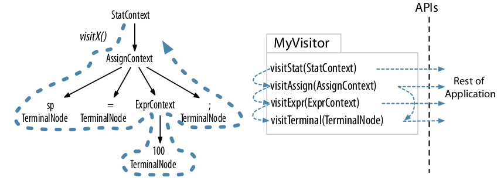
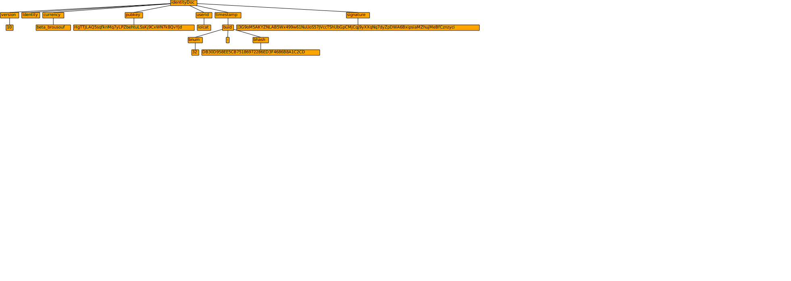

## You should be here if you are interested to 

 - Parse the duniter protocol in JavaScript, Go, Python, Cpp, CSharp, Java but do not know where to start 
 - Translate the protocol 
 - Write non ambiguous specifications
 - Spend time fixing my grammars 
 
 
## Usage
copy [PGLexer.g4](PGLexer.g4) and [PGParser.g4](PGParser.g4)
run next to the PGLexer.g4 and PGParser.g4

```
 antlr4 PG*.g4 ; javac PG*.java;  grun PG doc tests/tx.dup
```
 
 
## Background 

Grammars help you get the semantic of the data structure. its generic and universal, meaning it can specify any non ambiguous language. 



Using -gui you get a tool to visualize the graph


## ANTLR4 particularities 


antlr4 is composed of tokens (starting with uppercase) and rules (starting with lower case)

```
INT: 			BASE10 | ( BASE9 BASE10+ );
int:				INT;
```

A grammar is based on a lexer and a parser. the lexer (if enforced by keyword must have all Tokens required to parse the inputs without ambiguities).

```
parser grammar PGParser  ;
int:				INT;
...

lexer grammar PGLexer ;
INT: 			BASE9 BASE10+;
...

grammar PG; 
int:				INT;
INT: 			BASE9 BASE10+;
```

fragments are tokens that cannot be used alone, only as part of other tokens 

```
fragment COLON: 	':'  ;
fragment BASE9: 	[123456789];
fragment BASE10: 	[0123456789];
```

Tokens can trigger actions 
skip ignores the tokens (clean the parsed tree)
pushMode is pushing a "sub grammar" on a stack until popMode 
more keeps the tokens for reuse in the grammar (used on line separator to match both the token and the line separator)

```
-> skip			
-> pushMode(ULCK_MULTILN) ;
-> popMode ;
-> more ;
```

modes are like different grammars allowing to restrict language definition or embed languages one into another (html -> javascript -> json -> ...  ) this is pretty essential! but I use it mostly to remove ambiguities betweens the sections of the document. 


## Rewards 
a [reward] can be obtain for substancial and running code changes improving the following tasks. 
it can be written for any output language. 
if you want to participate to any of the rewards please send  
  - some Ğ1 to 4weakHxDBMJG9NShULG1g786eeGh7wwntMeLZBDhJFni
  - the reward name as comment 

My part of the reward is for antlr4 implementations, half of it for any other grammars generating multilingual parser including the JVM. subsequent participations will be paid in full.


 - 100 Ğ1 [GRAM_NAMING] : propose a different naming for grammar rules and/or tokens
 - 300 Ğ1 [GRAM_SIMPLE] : propose a clean and tidied simplification of the grammar without adding ambiguities
 - 500 Ğ1 [GRAM_VALID]  : Implement all local validation rules (accepted for any language output)
 - 200 Ğ1 [YAML_LEXER]  : write the YAML lexer. [Much inspiration here regarding indent](https://github.com/antlr/grammars-v4/blob/master/python3/Python3.g4)
 - 100 Ğ1 [JSON_LEXER]  : write the JSON lexer  
 - 100 Ğ1 [BIN_LEXER]   : write the BINARY lexer  
 - 100 Ğ1 [GRAM_DOC] 	: improve the documentation 
 
 - **1400 Ğ1** total
 
 
## Status of the PlayGround
 
PGParser presently contains a simplified grammar that output a yaml representation to the console as it parses the DUP protocol documents. 


